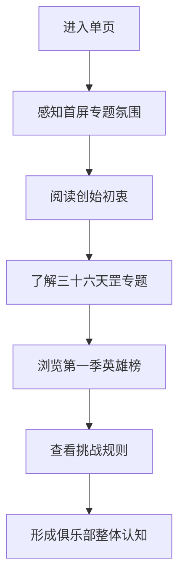

## 1. 产品概述
“北小河乒乓球俱乐部”首版单页以创始初衷为情感主线，以“北小河畔英雄会-望京乒坛三十六天罡”为核心专题，建立一个兼具温度、秩序与运动气质的对外展示入口。
- 面向球友、来访挑战者与新加入成员，传达俱乐部价值观、专题荣誉感与挑战机制，增强认同感与参与意愿。
- 首版以单页展示为主，不引入复杂交互或后台系统，优先完成品牌感、专题性与移动端体验。

## 2. 核心功能

### 2.1 功能模块
1. **首屏引导区**：俱乐部名称、专题标题、时间标识、核心口号与快速下滑入口。
2. **初心叙事区**：提炼创始初衷文案，塑造“有温度的球馆、有情怀的球友”氛围。
3. **专题荣誉区**：突出“望京乒坛三十六天罡”，强调第一季英雄榜与赛事仪式感。
4. **英雄榜展示区**：展示 2026.6.30 第一季 36 位上榜人物，支持清晰浏览与移动端分组阅读。
5. **挑战规则区**：结构化展示出擂、守擂、外来挑战者规则与备注信息。
6. **结尾行动区**：以简洁文案强化俱乐部精神，形成完整收束。

### 2.2 页面详情
| 页面名称 | 模块名称 | 功能描述 |
|-----------|-------------|---------------------|
| 首页 | 首屏引导区 | 展示俱乐部名称、专题主标题、英雄榜时间、情绪化引导文案和滚动提示 |
| 首页 | 初心叙事区 | 将原始长文整理为易读段落，强调“交流平台”“共同呵护”“有温度的球馆” |
| 首页 | 专题荣誉区 | 以视觉强调的方式介绍“三十六天罡”专题，营造榜单感与荣誉感 |
| 首页 | 英雄榜展示区 | 以响应式卡片或分栏形式呈现 36 位英雄名称，保证移动端可扫读性 |
| 首页 | 挑战规则区 | 分类展示天罡出擂、天罡守擂、外来挑战者规则与备注，信息清晰不拥挤 |
| 首页 | 结尾行动区 | 用俱乐部精神性文案收尾，增强页面完成度与情绪记忆点 |

## 3. 核心流程
用户进入页面后，先感知俱乐部气质与专题主视觉，再理解创始初心，随后浏览第一季英雄榜，最后查看挑战规则并形成对俱乐部机制与氛围的整体认知。

## 4. 用户界面设计
### 4.1 设计风格
- 主色：墨绿黑与深石墨灰，呼应夜场球馆、力量感与稳定感。
- 强调色：乒乓橙与暖金色，用于专题标题、序号、分隔线和关键信息。
- 按钮样式：首版仅保留简洁文字按钮或锚点按钮，圆角克制、边框利落。
- 字体建议：标题使用有冲击力的中文展示字体，正文字体使用清晰耐看的无衬线字体，形成“专题海报 + 现代阅读”组合。
- 布局风格：移动优先的纵向叙事型单页，辅以大标题、编号感标签、卡片式信息分区。
- 图形语言：使用球台线条、圆形球感、轻纹理背景和数字编号语言，避免复杂拟物。

### 4.2 页面设计概览
| 页面名称 | 模块名称 | UI 元素 |
|-----------|-------------|-------------|
| 首页 | 首屏引导区 | 大号专题标题、时间徽标、渐变背景、弱化装饰线、滚动引导动画 |
| 首页 | 初心叙事区 | 分段文案、引言样式、留白布局、轻微层叠卡片感 |
| 首页 | 专题荣誉区 | 强调数字“36”、专题副标题、短说明、视觉标签组 |
| 首页 | 英雄榜展示区 | 36 张简洁人物卡、编号系统、响应式网格、悬停高亮 |
| 首页 | 挑战规则区 | 分组三段式规则卡、备注提示条、信息层级清晰的标题结构 |
| 首页 | 结尾行动区 | 情绪化收尾文案、俱乐部精神关键词、轻量呼应首屏视觉 |

### 4.3 响应式设计
- 采用移动优先设计，小屏默认单列排布，优先保证可读性、触控间距与纵向滚动节奏。
- 在平板与桌面端逐步扩展为双列或多列布局，增强榜单展示效率与专题气场。
- 关键标题、榜单网格和规则卡片根据断点动态调整字号、边距与列数。
- 保持触控友好，重要点击区域不小于舒适操作尺寸，避免复杂悬浮依赖。
