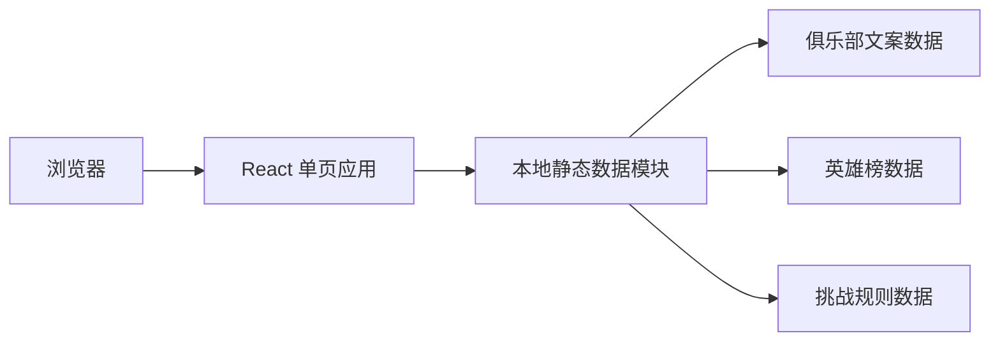
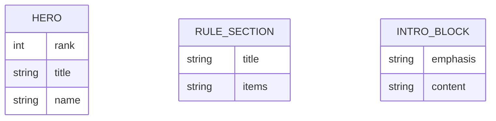

## 1. 架构设计


## 2. 技术描述
- 前端：React 18 + TypeScript + Vite
- 样式：Tailwind CSS 3，配合少量自定义 CSS 变量完成主题和纹理
- 路由：react-router-dom，首版保留单一路由入口
- 状态：zustand 预留，但首版静态展示页可不引入全局业务状态
- 图标：lucide-react
- 数据来源：将 `data/description.txt`、`data/heros.txt`、`data/rules.txt` 整理为前端静态常量

## 3. 路由定义
| 路由 | 用途 |
|-------|---------|
| / | 北小河乒乓球俱乐部专题首页，展示初心、英雄榜与挑战规则 |

## 4. API 定义
首版不引入后端接口，页面内容全部来自本地静态数据整理结果。

```ts
type HeroItem = {
  rank: number;
  title: string;
  name?: string;
};

type RuleSection = {
  title: string;
  items: string[];
};

type IntroBlock = {
  emphasis?: string;
  content: string;
};
```

## 5. 数据模型
### 5.1 数据模型定义


### 5.2 数据组织说明
- `introBlocks`：保存对创始初衷文案的分段整理结果，用于首页初心叙事区。
- `heroList`：保存第一季三十六天罡名单，包含序号、称号和姓名。
- `ruleSections`：保存挑战规则分组结构，分别对应出擂、守擂、外来挑战者与备注。

## 6. 前端实现拆分
- `src/pages/HomePage.tsx`：页面组装与各版块顺序控制。
- `src/components/SectionHeader.tsx`：统一的章节标题组件。
- `src/components/HeroGrid.tsx`：英雄榜网格展示组件。
- `src/components/RulesBoard.tsx`：挑战规则信息组件。
- `src/components/ValueNarrative.tsx`：初心叙事内容组件。
- `src/utils/content.ts`：整理静态数据与展示文案。

## 7. 视觉实现策略
- 采用“夜场球馆 + 荣誉榜”方向，背景以深色渐层和细微纹理构成空间感。
- 用大数字、细边框、局部高亮和留白建立专题海报气质，避免常规官网模板感。
- 首屏突出专题，不做复杂轮播；用滚动叙事增强阅读节奏。
- 英雄榜卡片在移动端保持单列或双列，在桌面端扩展到三至四列，确保信息密度适中。

## 8. 测试与验证
- 使用 Vitest + React Testing Library 为关键展示组件补充基础渲染测试。
- 执行 `npm run check` 验证 TypeScript 与构建质量。
- 启动本地开发服务后进行浏览器实机预览，验证移动端与桌面端断点表现。
